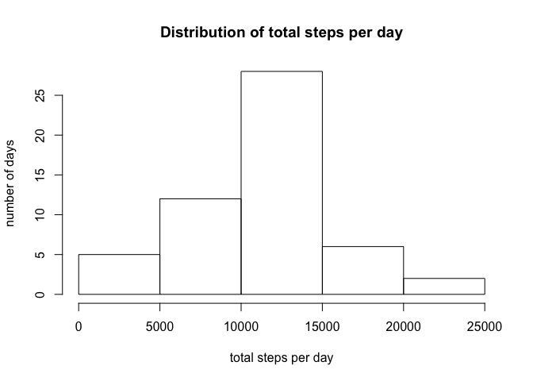
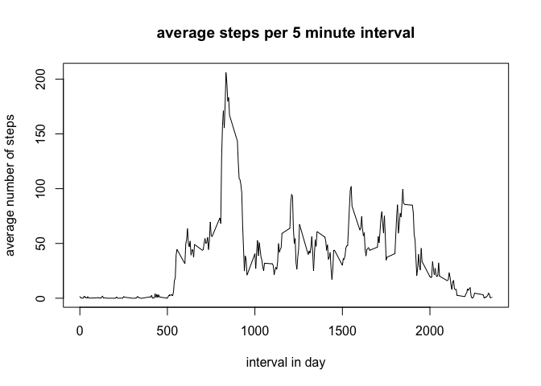
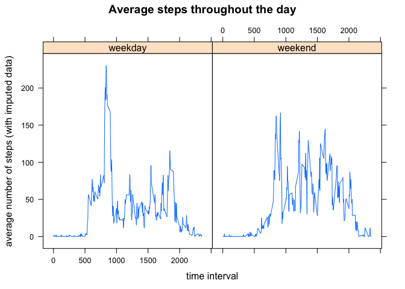

# Reproducible Research: Peer Assessment 1

## Loading and preprocessing the data


```r
unzip("activity.zip")
activityData <- read.csv("activity.csv")
activityData$date <- as.Date(activityData$date)
```

## What is mean total number of steps taken per day?
#### Answer: 10770 steps


```r
sumsDF <- aggregate(activityData$steps, by=list(date = activityData$date), FUN = sum)
names(sumsDF) <- c("date", "stepSum")
summary(sumsDF$step)
```

```
##    Min. 1st Qu.  Median    Mean 3rd Qu.    Max.    NA's 
##      41    8841   10760   10770   13290   21190       8
```

#### Histogram of total steps per day:

```r
hist(sumsDF$step, main = "Distribution of total steps per day", xlab = "total steps per day", ylab = "number of days")
```




## What is the average daily activity pattern?
#### There is a peak in the morning from intervals 800 to 900, and a steep decline at about 1800.

```r
avgIntervalsDF <- aggregate(activityData$steps, by=list(interval = activityData$interval), FUN = mean, na.rm=TRUE)
names(avgIntervalsDF) <- c("interval", "stepAverage")
plot(avgIntervalsDF$interval, avgIntervalsDF$stepAverage, type="l", main = "average steps per 5 minute interval", xlab = "interval in day", ylab = 
       "average number of steps")
```


#### The maximum number of steps during a day tends to be in interval 835. 

```r
avgIntervalsDF[which.max(avgIntervalsDF$stepAverage), ]
```

```
##     interval stepAverage
## 104      835    206.1698
```

## Imputing missing values

#### There are 2304 missing values.

```r
length(activityData$steps[is.na(activityData$steps)])
```

```
## [1] 2304
```
#### Strategy: Replace NA with average across all days for that interval

```r
imputFun <- function(thisStepValue, thisInterval) {
  if(is.na(thisStepValue)){
  val <- (avgIntervalsDF[avgIntervalsDF$interval == thisInterval, "stepAverage"])
    return (val)
   }
  else {
   return (thisStepValue)
  }
}

newVec <- mapply(FUN = imputFun, thisStepValue = activityData$steps, thisInterval = activityData$interval)  

imputedActivityData <- data.frame(newVec, activityData$date, activityData$interval)
names(imputedActivityData) <- c("imputedSteps", "date", "interval")
```

#### Histogram of total number of steps, for imputed data

```r
imputedSumsDF <- aggregate(imputedActivityData$imputedSteps, by=list(date = imputedActivityData$date), FUN = sum)
names(imputedSumsDF) <- c("date", "imputedStepSums")
hist(imputedSumsDF$imputedStepSums, main = "Distribution of total steps per day", xlab = "total steps per day (imputed using interval mean)", ylab = "number of days")
```


#### The mean with the original data is 10770. It remains unchanged using imputed data. The median increases from 10760 to 10770.

```r
# original summary stats
summary(sumsDF$step)
```

```
##    Min. 1st Qu.  Median    Mean 3rd Qu.    Max.    NA's 
##      41    8841   10760   10770   13290   21190       8
```

```r
# summary stats for imputed data
summary(imputedSumsDF$imputedStepSums)
```

```
##    Min. 1st Qu.  Median    Mean 3rd Qu.    Max. 
##      41    9819   10770   10770   12810   21190
```

## Are there differences in activity patterns between weekdays and weekends?
#### Weekend walking activity is more evenly spread throughout the day. Weekday activity is highest in the morning.

```r
weekdayVec <- weekdays(imputedActivityData$date)
weekdaySubVec <- sub("Monday|Tuesday|Wednesday|Thursday|Friday", "weekday", weekdayVec)
weekdaySubVec <- sub("Saturday|Sunday", "weekend", weekdaySubVec)
weekdaySubVec <- as.factor(weekdaySubVec)
imputedActivityData$dayCategory <- weekdaySubVec

imputedMeansDayCategoryDF <- aggregate(imputedActivityData$imputedSteps, by=list(interval = imputedActivityData$interval, dayCategory = imputedActivityData$dayCategory), FUN = mean)
names(imputedMeansDayCategoryDF) <- c("interval", "dayCategory", "imputedStepMeans")
library(lattice)
xyplot(imputedStepMeans~interval | factor(dayCategory), data=imputedMeansDayCategoryDF, type="l", main="Average steps throughout the day", xlab="time interval", ylab="average number of steps (with imputed data)")
```


